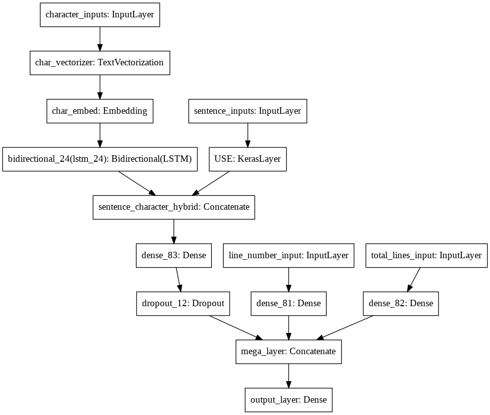

# MediClassify: A High-Accuracy Multimodal Classification System for Medical Paper Abstracts

Paper - https://arxiv.org/pdf/1612.05251.pdf

•	Engineered and trained a multimodal classifier combining NLP and structured data approaches using TensorFlow and Scikit-Learn, achieving 96% accuracy in classifying medical paper abstracts  
•	Employed BERT embeddings, ensemble methods to improve robustness and accuracy for complex medical text analysis

## Model Architecture

